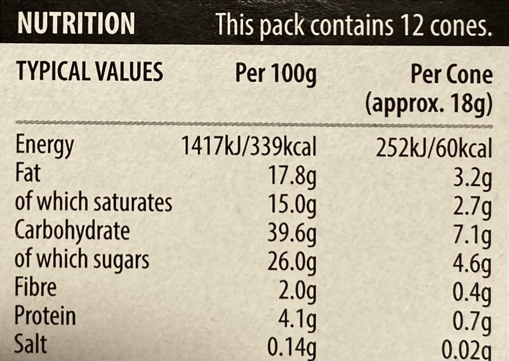

# 🥗 Healthy Food Prediction via Nutrition Table OCR & Machine Learning

This project leverages **OCR (Optical Character Recognition)** and **Machine Learning** to classify packed food items as **Healthy** or **Non-Healthy** based on their macro-nutrient content.

Rather than relying on pre-existing databases, this research uses **real-world food packaging images** (captured from grocery stores in Dublin) and classifies food using extracted nutritional data.

---

## 📌 Objective

To develop a lightweight and real-time classification system that:
- Extracts nutrient content from food labels using OCR
- Predicts whether a food item is healthy or not using ML classifiers
- Aims to assist individuals in making quick, data-driven food choices

---

## 📸 Sample Data

Collected **580+ images** from local stores like Tesco, Aldi, Lidl, and Dunnes in Dublin. Below are a few examples of nutrition label images used:

---

## 🧠 Methodology

### 1. **Image Collection & Preparation**
- 580 images captured using iPhone 11 in `.HEIC`, later converted to `.jpg`
- Cropped and resized (1024x1024) using Pillow

### 2. **OCR (Text Extraction)**
- Libraries tested: `Tesseract`, `EasyOCR`, `PaddleOCR`
- Final choice: **Google Vision API** (highest accuracy in text & numeric extraction)

### 3. **Nutrient Parsing**
- Extracted macro-nutrient values: Fat, Protein, Carbs, Fiber, Sugar, Salt
- Cleaned and normalized units using regex
- Missing values handled using **Random Forest Imputation**

### 4. **Nutri-Score Classification**
- Adapted Nutri-Score methodology (as used by OpenFoodFacts)
- Labeled food items:  
  - `A` or `B` → **Healthy**  
  - `C`, `D`, `E` → **Non-Healthy**

### 5. **ML Classification Models**
- Logistic Regression
- Random Forest
- SVM
- Decision Tree
- **Gradient Boosting** (best results)

---

## 🧪 Results

| Model                | Accuracy | Precision | Recall | F1 Score |
|----------------------|----------|-----------|--------|----------|
| Logistic Regression  | 94.8%    | 91.9%     | 100%   | 95.8%    |
| Decision Tree        | 94.2%    | 95.1%     | 95.1%  | 95.1%    |
| Random Forest        | 95.9%    | 93.6%     | 100%   | 96.7%    |
| SVM                  | 93.1%    | 89.5%     | 100%   | 94.5%    |
| **Gradient Boosting**| **97.1%**| **96.2%** | **99%**| **97.6%**|

---

## 🔍 Tools & Libraries

- `Google Vision API`
- `scikit-learn`
- `pandas`, `numpy`
- `Pillow`, `OpenCV`
- `Matplotlib`, `Seaborn`

---

## 🛠️ Project Structure

